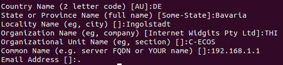

# TLS MQTT Client for RA6M5

## How to build the project correctly
Due to some needed changes in the library, some files needed to be changed. These changes are not considered by the e2studios code generation. Therefore, the following needs to be done.
1. make sure e2studio is set to FSP 4.4.0
2. open e2studio and generate the code
3. open the project folder `e2studio/mqtt_mutual_auth_ra6m5`
4. copy the folder `ra` from the `changed-libaries` folder into the `e2studio/mqtt_mutual_auth_ra6m5` folder
5. If asked replace the files.
6. Build the project

<b>Important!</b> Steps 3-6 need to be done every time the code is generated.

## Broker Configuration

Mosquitto running on Ubuntu 22.04 VM
<br>
Mosquitto config:
```
per_listener_settings true
listener 8883
allow_anonymous true
cafile ./mosquitto/ca.crt
certfile ./mosquitto/server.crt
keyfile ./mosquitto/server.key
tls_version tlsv1.2
```

### Certificate Generation

- [Mosquitto-tls man page](https://mosquitto.org/man/mosquitto-tls-7.html)
- [getting keys on the board](example_code/aws_https_demo_renesas/aws_https_client_notes.md)

## Client Configuration

`user_config.h`
- MQTT Broker Hostname (see credentials), Port and Identifier
- MQTT Topic names
- Credentials in PEM Format

## Usage

### MQTT Broker

`<hostname>` needs to be the same as the Common Name in the server certificate and the ip address/domain of the Broker

For example:<br>


start broker: `mosquitto -c <config file>`<br>
subscribe: `mosquitto_sub -h <hostname> -t testTopic -p 8883 --cafile ./mosquitto/server.crt`<br>
publish: `mosquitto_pub -h <hostname> -t instructionTopic -p 8883 --cafile ./mosquitto/server.crt -d -m "Test1"`<br>

### MQTT Client (RA6M5)

Running order
1. configures and initializes littlefs, mbedtls and provisions keys
2. Initializes IP stack and gets IP (when using DHCP)
3. Establishes TLS connection with multiple tries
4. Creates MQTT Connection to Broker
5. Subscribes to topic with multiple tries
6. Publishes to a topic for a specified number of times and waits till it received a specified number of messages
7. If sent and received the specified amount, disconnects the MQTT and TLS Connection and stops/deletes the task

## Next Steps

- implementing Keep Alive, Quality of Service and Last Will
- MQTT Agent Thread
- CAN connection